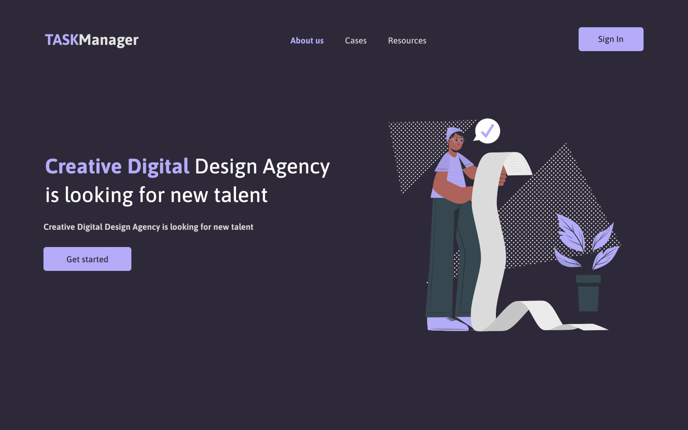

<center>


  # 🚧 Task Manager 🚧

&nbsp;
&nbsp;
&nbsp;
&nbsp;


</center>

<p>
TASKManager é um sistema de gerêncimento de tarefas, onde qualquer usuário tem acesso caso ele esteja
autenticado na aplicação. <br />

Essa aplicação basea-se a um teste que foi dado aos desenvolvedores front-end que estavam
a ser testado, na empresa em que eu trabalhava (GRUPO SNIR).
Sendo que o aprendizado é continuo, resolve fazer o teste mesmo sabendo que não foi direcionado pare me, porém pude adicionar novas features no projecto.
</p>

## Como rodar a aplicação

<p>
  
  Para rodar a aplicação é muito simple, abri o terminal na raíz do projecto e digite os seguintes comandos: <br />

  Usando YARN:  
  
  - Instalar as depedências:  ``` yarn  ``` or ``` yarn install ```
  - Executar:  ``` yarn dev```

  Usando NPM:  
  
  - Instalar as depedências:  ``` npm install ```
  - Executar:  ``` npm run dev```

</p>

## Funcionalidades 🚀

- [ ] - Autenticação com Google
- [ ] - Autenticação com Facebook
- [ ] - Mostrar dados do usuário autenticado
- [ ] - Listar tarefa
- [ ] - Adicionar tarefa
- [ ] - Actualizar tarefa
- [ ] - Remover tarefa

## Telas feitas 🚀

- [x] - Home
- [x] - Autenticação
- [x] - Dashboard
- [ ] - Tela para adicionar tarefa
- [ ] - Perfil

## Apresentação da aplicação

### Tela Home 🖥️



### Tela Autenticação 🔒️


### Tela Dashboard


### Tela Perfil do Usuário


<br />
<br />

## Autor

<table>
  <thead>
    <tr>
      <th>Foto</th>
      <th>Nome</th>
      <th></th>
    </tr>
  </thead>
  <tbody>
    <tr>
      <td>  </td>
      <td>Miguel Leite 🦸</td>
      <td>Desenvolvedor Font-End 🖥️</td>
    </tr>
  </tbody>
</table>
